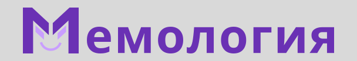

# Memology backend

   

Мемология - приложение VK MINI APPS, которое не одержало победы в VK FRESH CODE 2023. Это мини приложение представляет из себя каталог мемов. Суть нашего приложения заключается в том чтобы иметь базу знаний в мемах, например: историю мемов, рейтинг (что-то вроде трендов), описание и примеры. Так же в приложении существует система игр реализованных посредством Websockets с удобной автоматической типизацией как на фронте так и на бекенде. Сам API представляет из себя Protobuf over HTTP.

[Список победителей конкурса](https://vk.com/wall-166562603_6164)

Фронтенд вы можете найти [здесь](https://github.com/localhostov2/memology)
